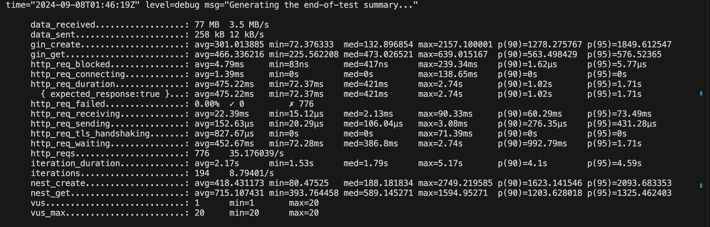
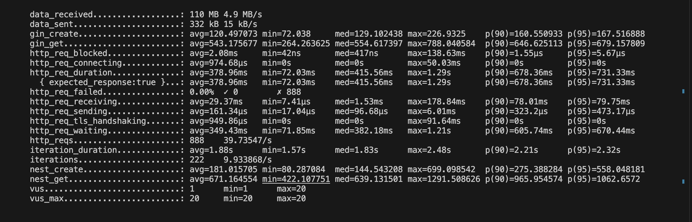
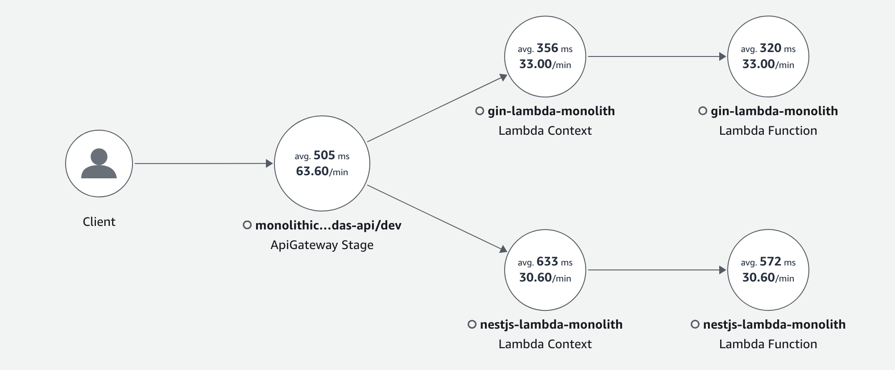

# Monolithic Lambdas Go (GIN) vs Node (NestJS)
Repository containing the code for the monolithic lambdas comparison between Go 1.23(GIN) and Node (NestJS).
Lambda NodeJS 20.x - Memory 128MB
Lambda Go 1.23 - Amazon Linux 2023 (provided.al2023) - Memory 128MB

## IAC
AWS CDK

## Comparison
 - Used Graphana k6 to make several requests to the lambda endpoints and compare the performance of both languages.
 - Used AWS CloudWatch to monitor the performance of the lambdas.
 - Used AWS X-Ray to monitor the performance of the lambdas.

 ## k6 results

 ### First Run 
 

 ### Second Run
 

## X-ray

## Conclusion

- For our POST route go is approximately 34% faster than NodeJS (using the average numbers).
-  For our GET route go is approximately 20% faster than NodeJS.

## Notes
 I tried different memory setups but results then to be similar,memory usage in go is always lower than NodeJS by more than 50% which means that as the app grows bigger and more complicated if we are still going with the lambda monolithic approach we will need to update our memory settings earlier for node than for go which could increase the cost.

 The intention of this comparison is pure fun and to learn more about the performance of both languages in the serverless world both either if you should use a lambda monolithic approach or not takes more than just performance into consideration [here](https://rehanvdm.com/blog/should-you-use-a-lambda-monolith-lambdalith-for-the-api) is a cool post that talks about the pros and cons of using a lambda monolithic approach and [here](https://docs.aws.amazon.com/lambda/latest/operatorguide/monolith.html) is the official AWS documentation on the topic.